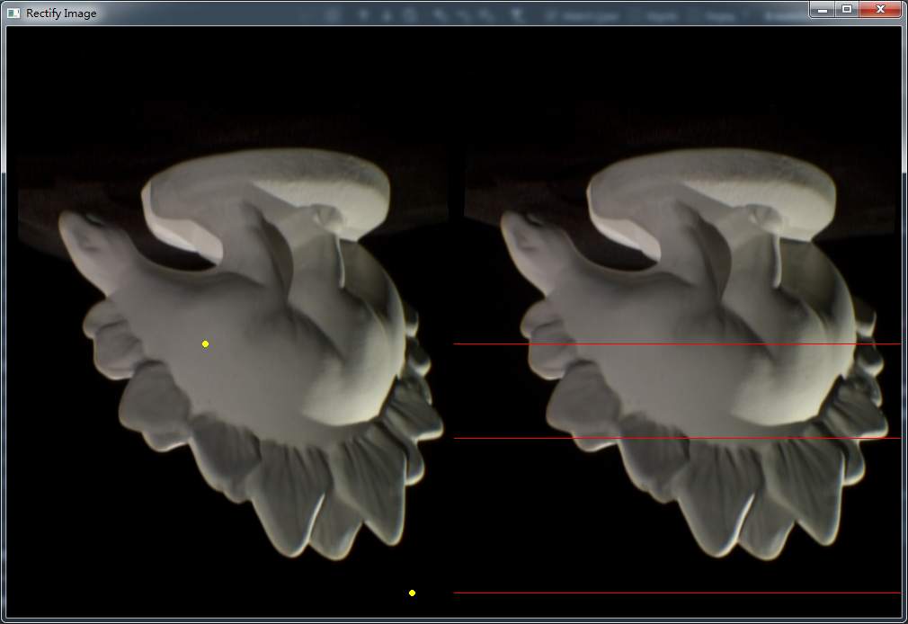
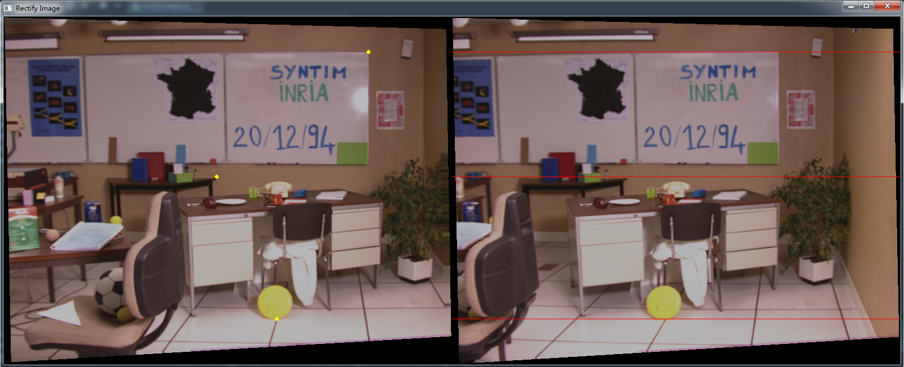

# RectifyImage
RectifyImageDemo
this is a python code [RectifyImageDemo](https://github.com/markeroon/matlab-computer-vision-routines/tree/master/third_party/RectifKitE)  
releated paper:[A Compact Algorithm for Rectication of Stereo Pairs](https://www.researchgate.net/publication/2800494_A_Compact_Algorithm_for_Rectification_of_Stereo_Pairs)
## result  

